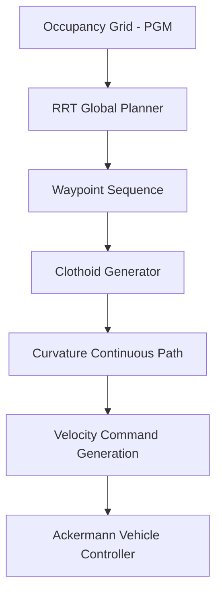
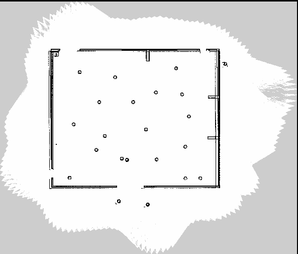

# Clothoid-Based Path Planning for Ackermann Vehicles

This repository implements a **deployable path planning pipeline for Ackermann-steered vehicles**, designed to bridge the gap between theoretical planners and real-world vehicle execution.

Most sampling-based planners (e.g., RRT) produce **point-to-point paths** that ignore steering constraints. While collision-free, these paths are often **not drivable** by car-like robots that cannot instantaneously change curvature.

This project addresses that gap by combining **RRT-based global planning** with **clothoid-based path smoothing** to generate **kinematically feasible, curvature-continuous trajectories** suitable for real vehicles.

🎥 **Demo Video:** https://www.youtube.com/watch?v=_fdF-cXDYKg
🔗 **Repository:** https://github.com/rituraj-navindgikar/clothoid-path-generator/

---

## Problem Statement

Ackermann-steered vehicles (cars, delivery robots, UGVs) are constrained by:

- Limited steering angle
- Continuous curvature requirements
- Non-holonomic motion

Standard planners such as RRT:

- Assume instant heading changes
- Produce sharp turns at waypoints
- Fail when directly executed on hardware

The result is a path that looks valid in simulation but **breaks down during execution**.

---

## Solution Overview

This project implements a **two-stage planning pipeline**:

1. **Global Planning (RRT)**Computes a collision-free path through an occupancy grid map.
2. **Local Smoothing (Clothoids)**Replaces straight-line segments with **Euler spiral (clothoid) curves**, ensuring:

   - Linear curvature variation
   - Smooth steering transitions
   - Feasible Ackermann execution

Clothoids are widely used in road and rail design for exactly this reason.

---

## System Architecture



---

## Key Contributions (Beyond the Reference Paper)

### 1. Automatic Path-Type Fallback Logic

The original clothoid formulation assumes **manual selection** of path type.

This implementation adds **dynamic fallback logic**:

- Try **symmetric clothoid**
- If it fails, try **unsymmetric clothoid**
- If that fails, fall back to **single-segment clothoid**

This significantly improves robustness in tight or highly constrained geometries.

---

### 2. Full ROS2 Integration

The planner is fully integrated into a **ROS2-based navigation stack**:

- Accepts occupancy grids
- Publishes executable trajectories
- Converts curvature profiles into **linear and angular velocity commands** compatible with Ackermann steering

This bridges theory → control → execution.

---

### 3. Hardware-Oriented Design

Unlike purely simulation-focused planners, this system was designed with execution in mind:

- Curvature continuity enforced
- Steering limits respected
- Real-time constraints considered
- Suitable for direct deployment on vehicles like the **AgileX Hunter**

---

## Simulation Environment

### Occupancy Grid Map

Generated by simulating a LiDAR sensor and mapping the environment into a PGM file.
Each cell represents free, occupied, or unknown space.



---

### Gazebo Simulation Setup

Ackermann-steered AgileX Hunter robot navigating a cluttered environment with cones and walls.


---

## Results

### RRT Global Path

Collision-free but **not directly drivable** due to sharp heading changes.


---

### Clothoid-Smoothed Path

Curvature-continuous trajectory suitable for Ackermann steering and real execution.


---

## Technologies Used

- ROS2
- C++ / Python
- RRT (sampling-based planning)
- Clothoid / Euler spiral path generation
- Ackermann kinematics
- Gazebo simulation
- Occupancy grid mapping

---

## Why This Matters

This project demonstrates how to:

- Take a theoretically correct planner
- Identify why it fails on real robots
- Engineer a **robust, execution-ready solution**

The result is not just a path planner, but a **practical navigation component** that respects vehicle physics, steering constraints, and real-time control requirements.

---

## Author

**Rituraj Harish Navindgikar**
MS Robotics, Northeastern University
LinkedIn: https://linkedin.com/in/rituraj-navindgikar

```

```
